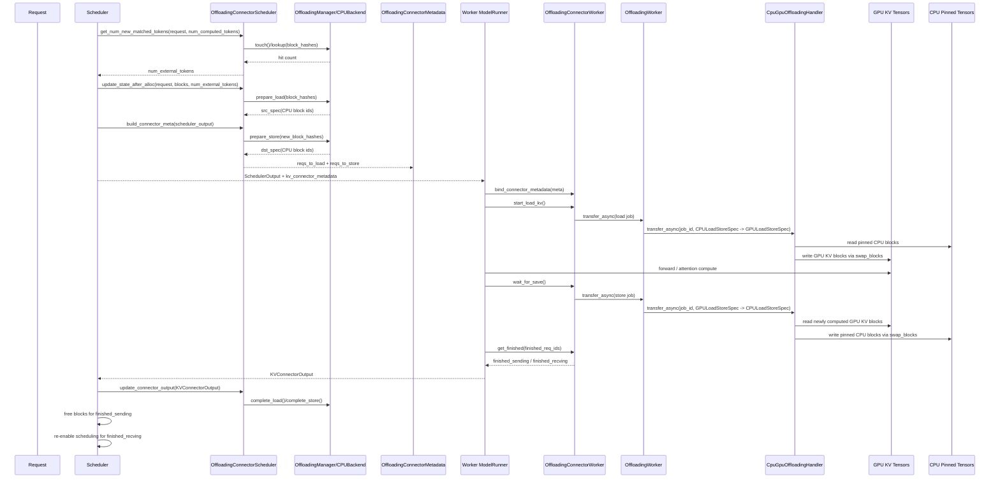

# vLLM KV Cache CPU Offload 实现梳理

本文整理 vLLM 工程中“把 KV cache 从 GPU offload 到 CPU，并在后续请求中从 CPU 恢复回 GPU”的实现路径，重点覆盖：

- v1 原生 native offload 主链路
- 一次真实请求的 store 和 load 调用展开
- 从 scheduler 到 worker，再到 CPU tensor / GPU tensor 的调用时序图
- LMCache offload 的实现方式与原生实现的差异
- legacy `swap-space` 旧路径和 v1 native offload 的区别

## 1. 范围与结论

先区分三条容易混淆的路径：

1. v1 原生 KV offload

   当前主线实现是 `OffloadingConnector` + `vllm/v1/kv_offload/*`。这是本文重点。

2. LMCache offload

   这条路径通过 `LMCacheConnectorV1` 把 KV 的存取委托给外部 LMCache 引擎，本质上不是 vLLM 自己维护 CPU tensor 池。

3. legacy `swap-space` / preemption swap

   这是较老的“请求被抢占时 swap 到 CPU”的路径。v1 文档已明确把它视为 legacy，不能和当前 native offload 混为一谈。

结论上，当前仓库里真正完整、可追踪的原生 CPU offload 主线是：

`Scheduler -> OffloadingConnectorScheduler -> OffloadingManager/CPUBackend -> OffloadingConnectorMetadata -> Worker OffloadingConnector -> OffloadingWorker -> CpuGpuOffloadingHandler -> CPU pinned tensors / GPU KV tensors -> swap_blocks custom op`

## 2. 关键文件地图

### 2.1 配置与入口

- `vllm/config/cache.py`
  - 定义 `kv_offloading_size`、`kv_offloading_backend`。
- `vllm/config/vllm.py`
  - `_post_init_kv_transfer_config()` 在 native 模式下把 `kv_connector` 设为 `OffloadingConnector`。
- `vllm/v1/engine/core.py`
  - 初始化 KV cache、scheduler、worker，并把 connector 相关链路接起来。
- `vllm/v1/worker/gpu_model_runner.py`
  - 初始化 KV tensors 后注册给 KV transfer group。

### 2.2 原生 offload 核心

- `vllm/distributed/kv_transfer/kv_connector/v1/offloading_connector.py`
  - scheduler / worker 两端的 connector 主实现。
- `vllm/v1/kv_offload/spec.py`
  - offload spec 抽象。
- `vllm/v1/kv_offload/factory.py`
  - 通过 `spec_name` 创建具体 offload spec。
- `vllm/v1/kv_offload/cpu.py`
  - `CPUOffloadingSpec`，把 backend/manager/worker handler 组装起来。
- `vllm/v1/kv_offload/abstract.py`
  - `OffloadingManager`、`LoadStoreSpec`、`PrepareStoreOutput` 抽象。
- `vllm/v1/kv_offload/lru_manager.py`
  - 原生 CPU offload 的默认淘汰策略实现。
- `vllm/v1/kv_offload/backends/cpu.py`
  - CPU block 分配、回收、block_id 管理。
- `vllm/v1/kv_offload/worker/worker.py`
  - worker 侧异步传输任务分发。
- `vllm/v1/kv_offload/worker/cpu_gpu.py`
  - 真正持有 CPU pinned tensors，并执行 H2D/D2H 块搬运。

### 2.3 LMCache 相关

- `vllm/distributed/kv_transfer/kv_connector/v1/lmcache_connector.py`
  - vLLM 到 LMCache 的 connector 外层适配。
- `vllm/distributed/kv_transfer/kv_connector/v1/lmcache_integration/vllm_v1_adapter.py`
  - v1 主适配器，实现 scheduler/worker 两端逻辑。
- `vllm/distributed/kv_transfer/kv_connector/v1/lmcache_integration/utils.py`
  - LMCache 配置与元数据辅助函数。
- `vllm/distributed/kv_transfer/kv_connector/v1/lmcache_integration/multi_process_adapter.py`
  - 多进程 / IPC 版本的 LMCache 适配。
- `examples/others/lmcache/cpu_offload_lmcache.py`
  - LMCache 本地 CPU backend 示例。

### 2.4 测试与基准

- `tests/v1/kv_offload/test_cpu_offloading.py`
  - 原生 CPU offload 的端到端测试。
- `tests/v1/kv_connector/unit/test_offloading_connector.py`
  - OffloadingConnector 单元测试。
- `tests/v1/kv_connector/unit/test_config.py`
  - `kv_offloading_backend=native` 的配置测试。
- `benchmarks/benchmark_host_kv_restore_compute.py`
  - 显式测量“host -> GPU restore”成本的微基准。

## 3. 配置入口与一个需要注意的现实情况

native CPU offload 的顶层配置入口在 `CacheConfig`：

- `kv_offloading_backend="native"`
- `kv_offloading_size=<GiB>`

`VllmConfig._post_init_kv_transfer_config()` 会把配置改写成：

- `kv_connector="OffloadingConnector"`
- `kv_role="kv_both"`
- `kv_connector_extra_config["kv_bytes_per_rank"] = kv_offloading_size / num_kv_ranks`
- `kv_connector_extra_config["num_cpu_blocks"] = 0`

这里源码有一个重要注释：`num_cpu_blocks` 的真实换算应该在 KV cache 初始化之后再做。

从当前仓库可见代码来看：

- 这一步“`kv_bytes_per_rank -> num_cpu_blocks` 的自动换算”没有在同一条主链路里明确落地出来。
- 现有配置测试只验证这里会先写入占位值 `num_cpu_blocks=0`。
- 真正可跑通的原生 offload 测试，是直接显式传入：

```python
KVTransferConfig(
    kv_connector="OffloadingConnector",
    kv_role="kv_both",
    kv_connector_extra_config={
        "num_cpu_blocks": 1000,
        "block_size": 16,
    },
)
```

因此，如果你要实际验证 native offload，当前最直接可靠的做法仍然是显式给出 `num_cpu_blocks`。

## 4. 原生 offload 的总体架构

原生 offload 可以分成四层：

1. scheduler 决策层

   负责判断哪些 block 可从 CPU 命中，哪些新 block 需要写到 CPU，以及何时完成状态回收。

2. metadata 打包层

   scheduler 把本 step 的 load/store 计划打包成 `OffloadingConnectorMetadata`，随 `SchedulerOutput` 发给 worker。

3. worker 执行层

   worker 根据 metadata 启动异步 load/store 任务，并在 step 结束后回报哪些请求的 load/store 已完成。

4. 物理存储层

   CPU 侧是按层分配的一组 pinned tensors；GPU 侧是模型已有的 paged KV cache tensors；块级搬运通过 `swap_blocks` 自定义算子完成。

## 5. 从 scheduler 到 worker，再到 CPU tensor / GPU tensor 的时序图

下面这张图描述的是一次普通 step 中，native offload 的完整闭环。图里同时画出了 load 和 store，两者可能在同一个 step 内并存。



## 6. OffloadingConnector 的 store 路径逐函数展开

这一节按“一次真实请求第一次运行，需要把新生成的 KV 存到 CPU”的视角展开。

### 6.1 scheduler 判断这一步有哪些 block 需要存

入口：`Scheduler.schedule()`

在调度完成后，如果启用了 connector，会调用：

- `connector.build_connector_meta(scheduler_output)`

对 OffloadingConnector 而言，这会进入：

- `OffloadingConnector.build_connector_meta()`
- `OffloadingConnectorScheduler.build_connector_meta()`
- `OffloadingConnectorScheduler._get_reqs_to_store()`

`_get_reqs_to_store()` 主要做这些事：

1. 遍历本 step 被调度的 request，包括新请求和 cached request。
2. 根据 `scheduler_output.num_scheduled_tokens[req_id]` 算出本 step 结束后总共有多少 token。
3. 按 `offloaded_block_size` 折算出“已经完整形成了多少个 CPU offload block”。
4. 用 `_next_stored_block_idx[req_id]` 找出哪些 offload block 是新增的、还没存过的。
5. 提取这些 block 对应的 `block_hashes`。
6. 调用 `manager.prepare_store(new_block_hashes)`：
   - 过滤掉已经存过的 block hash。
   - 如空间不足，按 LRU 选择要驱逐的 CPU block。
   - 分配新的 CPU block_id。
   - 返回 `PrepareStoreOutput(block_hashes_to_store, store_spec, evicted)`。
7. 根据 `block_size_factor` 把一个 CPU block 对应展开成多个 GPU block_id，构造：
   - `src_spec = GPULoadStoreSpec(src_block_ids)`
   - `dst_spec = CPULoadStoreSpec(cpu_block_ids)`
8. 将 `(src_spec, dst_spec)` 挂到 `reqs_to_store[req_id]`。

此时 scheduler 只是“计划”了要存哪些 block，并没有真正发生 D2H copy。

### 6.2 metadata 下发到 worker

`OffloadingConnectorScheduler.build_connector_meta()` 返回：

```python
OffloadingConnectorMetadata(
    reqs_to_load=..., 
    reqs_to_store=...
)
```

这个 metadata 会被放进 `SchedulerOutput.kv_connector_metadata`，随后传给 worker。

### 6.3 worker 在 step 收尾时真正触发 store

worker 侧入口在：

- `KVConnectorModelRunnerMixin._get_kv_connector_output()`

这个 context manager 在 forward 生命周期末尾会调用：

- `kv_connector.wait_for_save()`

对于 OffloadingConnector，这会进入：

- `OffloadingConnector.wait_for_save()`
- `OffloadingConnectorWorker.start_store_kv(metadata)`

`start_store_kv()` 会：

1. 遍历 `metadata.reqs_to_store`。
2. 为每个 request 生成 `job_id`。
3. 把 `(req_id, store=True)` 记入 `_jobs`。
4. 调用 `self.worker.transfer_async(job_id, transfer_spec)`。

### 6.4 OffloadingWorker 选择正确的 handler

`OffloadingWorker.transfer_async()` 根据 `(src.medium(), dst.medium())` 做路由：

- `("GPU", "CPU") -> CpuGpuOffloadingHandler`

这层本身不拷数据，它只做 transfer type 分发。

### 6.5 CpuGpuOffloadingHandler 执行 D2H 块搬运

真正执行 store 的逻辑在：

- `CpuGpuOffloadingHandler.transfer_async(job_id, spec)`

以 store 为例：

1. 识别 `src_spec` 是 `GPULoadStoreSpec`，`dst_spec` 是 `CPULoadStoreSpec`。
2. 选择 `d2h_stream`。
3. 计算 `src_block_size_factor=1`、`dst_block_size_factor=block_size_factor`。
4. 用 `expand_block_ids()` 把 GPU block ids 和 CPU block ids 展开成逐子块映射。
5. 生成 `src_to_dst_tensor`，形状是 `(num_sub_blocks, 2)`。
6. 对每一层 KV tensor 执行：
   - 如果 backend 的 KV shape 是 `(2, num_blocks, ...)`，分开处理 key/value。
   - 否则直接对整个 tensor 调用一次 `ops.swap_blocks(src, dst, mapping)`。
7. 在 stream 上记录 CUDA event。
8. 将 `job_id -> event` 记入 `transfer_events`。

这里的 CPU tensor 是在 handler 初始化时一次性分配好的 pinned memory。

### 6.6 job 完成后如何回到 scheduler

worker 在 step 结束时调用：

- `kv_connector.get_finished(finished_req_ids)`

对 OffloadingConnector：

- `OffloadingConnectorWorker.get_finished()`
- `OffloadingWorker.get_finished()`
- `CpuGpuOffloadingHandler.get_finished()`

`CpuGpuOffloadingHandler.get_finished()` 会轮询 `event.query()`，返回完成的 `job_id`。

随后：

1. worker 生成 `KVConnectorOutput.finished_sending`。
2. scheduler 在下一步 `update_from_output()` 中调用：
   - `Scheduler._update_from_kv_xfer_finished()`
   - `connector.update_connector_output(kv_connector_output)`
3. 对 OffloadingConnector，这会进入：
   - `OffloadingConnectorScheduler.update_connector_output()`
   - `manager.complete_store(block_hashes)`
4. store 完成后，这些 block hash 才会真正变成“可供 future load 命中”的 ready 状态。

如果 request 已经结束，worker 侧还会把它放进 `finished_sending`，scheduler 收到后再释放对应 GPU blocks。

## 7. OffloadingConnector 的 load 路径逐函数展开

这一节按“后续请求来到时，GPU prefix cache miss，但 CPU offload 命中，需要从 CPU 恢复到 GPU”的视角展开。

### 7.1 scheduler 先判断 CPU 侧能命中多少 token

入口是 connector 的：

- `OffloadingConnector.get_num_new_matched_tokens(request, num_computed_tokens)`

实际进入：

- `OffloadingConnectorScheduler.get_num_new_matched_tokens()`

逻辑如下：

1. 根据 request token 长度按 `offloaded_block_size` 折算出理论上有多少个 offload block。
2. 用 `_get_block_hashes()` 以 stride 方式抽取“每个 CPU offload block 对应的 block hash”。
3. 调用 `manager.touch(block_hashes)` 更新 LRU 热度。
4. 从 `start_block_idx = num_computed_tokens // offloaded_block_size` 开始，调用：
   - `manager.lookup(block_hashes[start_block_idx:])`
5. `lookup()` 返回从当前位置开始连续命中的 block 数。
6. 再折算成 `num_hit_tokens` 返回给 scheduler。

注意这里返回的是“CPU 侧还能补多少 token”，并且要求至少达到一个完整的 offload block 才会触发加载。

### 7.2 scheduler 分配 GPU blocks 后，准备 load spec

当 scheduler 决定这部分 token 走 external load 时，会在 block 已经分配完成之后调用：

- `OffloadingConnectorScheduler.update_state_after_alloc(request, blocks, num_external_tokens)`

这个函数负责：

1. 记录 request 与当前 GPU block ids 的关系。
2. 根据 `num_external_tokens` 算出这次要从 CPU 恢复多少个 offload block。
3. 调用 `manager.prepare_load(block_hashes)`：
   - 这些 block 必须都已经 stored 且 ready。
   - manager 会暂时提高它们的 `ref_cnt`，避免在 load 期间被驱逐。
4. 构造：
   - `src_spec = CPULoadStoreSpec(cpu_block_ids)`
   - `dst_spec = GPULoadStoreSpec(gpu_block_ids_to_fill)`
5. 写入 `_reqs_to_load[request_id]`。

### 7.3 worker 在 forward 前启动 H2D 恢复

worker 侧，在真正 forward 开始之前，`KVConnectorModelRunnerMixin` 会调用：

- `kv_connector.bind_connector_metadata(meta)`
- `kv_connector.start_load_kv(get_forward_context())`

对于 OffloadingConnector：

- `OffloadingConnector.start_load_kv()`
- `OffloadingConnectorWorker.start_load_kv(metadata)`

`start_load_kv()` 会：

1. 遍历 `metadata.reqs_to_load`。
2. 为每个 request 分配一个 `job_id`。
3. 在 `_load_job[req_id]` 中记录该请求当前的 load job。
4. 通过 `OffloadingWorker.transfer_async(job_id, spec)` 提交任务。

### 7.4 CpuGpuOffloadingHandler 执行 H2D 恢复

进入 `CpuGpuOffloadingHandler.transfer_async()` 后，load 分支与 store 类似，只是方向相反：

1. 检测 `src_spec` 是 `CPULoadStoreSpec`，`dst_spec` 是 `GPULoadStoreSpec`。
2. 选择 `h2d_stream`。
3. 设置 `src_block_size_factor=block_size_factor`，`dst_block_size_factor=1`。
4. 展开 block id 映射表。
5. 对每层 KV tensor 调用 `ops.swap_blocks()` 把 CPU pinned tensor 的相应块写回 GPU paged KV tensor。
6. 在 stream 上打 event，进入异步完成态。

### 7.5 load 完成后 scheduler 如何让请求继续跑

worker 在 step 结束时把已完成 load 的 request_id 放进：

- `KVConnectorOutput.finished_recving`

scheduler 下一步会在：

- `Scheduler._update_from_kv_xfer_finished()`

里把这些 request_id 放进 `finished_recving_kv_req_ids`。

随后，当 scheduler 再次检查该 request 时，会走：

- `Scheduler._update_waiting_for_remote_kv(request)`

这里会：

1. 如果没有 load 错误，则根据刚才分配到的 GPU block_ids 推断 `num_computed_tokens`。
2. 调用 `kv_cache_manager.cache_blocks(request, num_computed_tokens)` 把这批“远端恢复回来的块”正式并入本地 cache 视图。
3. 更新 `request.num_computed_tokens`。
4. 把 request 从 `WAITING_FOR_REMOTE_KV` 重新放回可调度状态。

同时，connector 侧还会调用：

- `OffloadingConnectorScheduler.update_connector_output()`
- `manager.complete_load(block_hashes)`

这样这些被保护的 CPU blocks 才重新允许被 eviction。

## 8. CPU 侧物理布局和拷贝原语

### 8.1 CPU tensor 是怎么分配的

`CpuGpuOffloadingHandler.__init__()` 会为每个 layer 的 GPU KV tensor 分配一个对应的 CPU tensor：

- device 是 `cpu`
- 优先使用 pinned memory
- shape 与 GPU tensor 基本一致，只是 `num_blocks` 维度替换为：

`num_cpu_blocks * block_size_factor`

这样一个 CPU block 就能承载多个 GPU-side paged blocks。

### 8.2 为什么有 `block_size_factor`

native offload 支持 CPU 侧 block size 大于 GPU paged block size。

例如：

- GPU block size = 16 tokens
- CPU offloaded block size = 64 tokens

那么：

- `block_size_factor = 64 / 16 = 4`

这意味着：

- scheduler 在 offload manager 里追踪的是“64 token 一个 block”的 CPU 视角。
- worker 真正拷贝时需要把它映射成 4 个 GPU paged blocks。

### 8.3 真正的 copy 原语

真正的块级搬运调用链是：

- `CpuGpuOffloadingHandler.transfer_async()`
- `vllm._custom_ops.swap_blocks()`
- `torch.ops._C_cache_ops.swap_blocks(...)`

因此，native offload 的关键不是 Python 层的 tensor slice copy，而是底层自定义 cache op。

此外，仓库里还保留了较早的 host/device copy 抽象：

- `current_platform.insert_blocks_to_device`
- `current_platform.swap_out_blocks_to_host`

它们被 `vllm/distributed/kv_transfer/kv_connector/utils.py` 中的 `copy_kv_blocks()` 使用，但 OffloadingConnector 当前 worker 主链路直接使用的是 `swap_blocks`。

## 9. LMCache offload 是如何实现的

LMCache 路径与 native offload 最大的区别在于：

- native：vLLM 自己维护 CPU block 索引、LRU、CPU pinned tensors 和搬运。
- LMCache：vLLM 只做适配与调度决策，真正的 KV 存储、lookup、chunk 管理、CPU/local backend 由 LMCache 引擎负责。

### 9.1 外层入口

入口类是：

- `LMCacheConnectorV1`

它本身只是一个 facade，把所有 scheduler/worker 调用委托给：

- `lmcache_integration.vllm_v1_adapter.LMCacheConnectorV1Impl`

如果配置 `use_native=False`，也可以委托给外部 lmcache 包提供的最新实现。

### 9.2 LMCache 的调度粒度不是 block，而是 chunk

在 LMCache 适配中，核心单位不再是 vLLM 的 page/block，而是 LMCache 的 chunk。

典型关系是：

- `lmcache chunk size` 必须是 `vLLM block size` 的整数倍。
- 适配器会计算：

`blocks_in_chunk = lmcache_chunk_size // vllm_block_size`

这样：

- scheduler lookup 时，并不是逐个 vLLM block 查，而是 stride 地抽取每个 chunk 的代表 hash 去问 LMCache。

这部分逻辑在：

- `lmcache_integration/multi_process_adapter.py`
- `striding_block_hashes()`
- `LMCacheMPSchedulerAdapter.maybe_submit_lookup_request()`

### 9.3 scheduler 侧如何决定 load/save

LMCache v1 adapter 在 scheduler 侧维护：

- `RequestTracker`
- `LoadSpec`
- `SaveSpec`
- `ReqMeta`

一次 step 中，`build_connector_meta()` 做的事大致是：

1. 为新请求和运行中请求维护 `RequestTracker`。
2. 跟踪当前 request 已有哪些 token 已经保存在 LMCache 中。
3. 计算：
   - 本次有哪些 token 可从 LMCache 读出
   - 本次有哪些 token 需要保存到 LMCache
4. 按 chunk 边界裁切，避免部分 chunk 的不一致保存。
5. 生成 `LMCacheConnectorMetadata.requests`，其中每个 request 携带：
   - `load_spec`
   - `save_spec`
   - `slot_mapping`
   - `token_ids`
   - 可能的多模态 hash / positions

与 native offload 不同，LMCache adapter 会显式处理：

- chunk 对齐
- 多模态 placeholder hash 覆盖
- decode 阶段是否允许保存
- disaggregated prefill 的特殊 transfer 参数

### 9.4 worker 侧 load：retrieve 到 vLLM paged buffer

worker 侧入口仍是：

- `start_load_kv(forward_context)`

但内部逻辑和 native 差异很大：

1. 从 `forward_context.no_compile_layers` 中懒加载拿到各层 `kv_cache` tensor。
2. 调用 `lmcache_engine.post_init(kvcaches=...)`，把 vLLM 当前的 KV buffer 注册给 LMCache engine。
3. 遍历 metadata 中要加载的 request。
4. 对每个 request 计算：
   - 哪些 token 已经在 vLLM 本地 cache 命中
   - 哪些 token 需要从 LMCache retrieve
5. 非 layerwise 模式下，直接调用：

   - `lmcache_engine.retrieve(...)`

6. layerwise 模式下，创建生成器：

   - `lmcache_engine.retrieve_layer(...)`

然后由：

- `wait_for_layer_load(layer_name)`

逐层推进 generator，保证 attention 层在真正使用 KV 前，对应层的数据已经被恢复进 vLLM paged KV buffer。

也就是说，LMCache 的 load 不是自己维护 CPU tensor 再调 `swap_blocks`，而是让 LMCache engine 按其内部 backend/connector 语义把数据写回当前的 vLLM KV buffer。

### 9.5 worker 侧 store：把 vLLM paged buffer 交给 LMCache engine 保存

worker 侧保存有两种模式：

1. 非 layerwise

   `wait_for_save()` 中直接遍历 request，调用：

   - `lmcache_engine.store(...)`

2. layerwise

   attention 层运行时通过：

   - `save_kv_layer(layer_name, kv_layer, attn_metadata)`

   为每个 request 构造：

   - `store_mask`
   - `skip_leading_tokens`
   - chunk 对齐后的保存范围

   然后调用：

   - `lmcache_engine.store_layer(...)`

   最后在 `wait_for_save()` 中把这些 generator 推进到底。

这里的关键点是：LMCache 保存时不是自己管理 `CPUBlockStatus` / `LRUOffloadingManager`，而是交给 LMCache 引擎决定数据放到本地 CPU、远端缓存或其他 backend。

### 9.6 lookup pin / unpin

LMCache 路径还有一个 native 路径没有的显式概念：lookup pin/unpin。

在一个 step 内，scheduler 会记录本 step 查过的 lookup 请求；worker 在 `wait_for_save()` 里调用：

- `lmcache_engine.lookup_unpin(...)`

目的是在 load/save 生命周期结束后，释放 LMCache engine 对这些 lookup 结果的临时占用或保护状态。

### 9.7 LMCache 的本地 CPU offload 示例

如果把 LMCache 配成 local CPU backend，那么它同样能表现为“KV offload 到 CPU”。示例在：

- `examples/others/lmcache/cpu_offload_lmcache.py`

这个例子通过环境变量打开：

- `LMCACHE_LOCAL_CPU=True`
- `LMCACHE_MAX_LOCAL_CPU_SIZE=5.0`

然后让 `LMCacheConnectorV1` 把 KV 存到 LMCache 的本地 CPU 存储中。

因此，LMCache 也能完成“CPU offload”，但实现主体已经不是 vLLM 自身，而是 LMCache。

## 10. native offload 与 LMCache 的对比

| 维度 | native OffloadingConnector | LMCacheConnectorV1 |
|---|---|---|
| 存储管理者 | vLLM 自己 | LMCache engine |
| CPU 内存布局 | vLLM 自分配 pinned tensors | 由 LMCache backend 决定 |
| 索引粒度 | vLLM block hash + CPU block_id | LMCache chunk/key |
| 淘汰策略 | vLLM LRU / ARC manager | 由 LMCache engine/backend 决定 |
| 数据拷贝原语 | `swap_blocks` custom op | `lmcache_engine.retrieve/store` 或 layerwise 版本 |
| scheduler 关注点 | 连续 block 命中、CPU block 分配、eviction | chunk lookup、chunk 对齐、request tracker |
| worker 关注点 | CPU tensor <-> GPU tensor 直接拷贝 | 把 vLLM paged buffer 注册给 LMCache，由 LMCache 完成读写 |

## 11. legacy `swap-space` 路径说明

`docs/design/metrics.md` 中明确说明，下面两个指标对应的是旧的“swapped preemption mode”：

- `vllm:num_requests_swapped`
- `vllm:cpu_cache_usage_perc`

这个模式的语义是：

- request 被 preempt 时，把它的 KV blocks swap 到 CPU，腾出 GPU cache 空间。

这条路径和 v1 当前的 native offload 不是同一个实现方向。v1 现在更偏向：

- prefix caching
- 按需重算
- connector 驱动的外部 KV load/store

因此分析当前工程时，建议把 legacy swap-space 当成背景资料，而不是当前主线实现。

## 12. 建议的阅读顺序

如果要继续深入源码，建议按这个顺序读：

1. `vllm/distributed/kv_transfer/kv_connector/v1/base.py`
   - 先建立 scheduler/worker connector 抽象。
2. `vllm/distributed/kv_transfer/kv_connector/v1/offloading_connector.py`
   - 看 native offload 的调度与 worker 协作。
3. `vllm/v1/kv_offload/cpu.py`
   - 看 native spec 如何选择 manager/backend/handler。
4. `vllm/v1/kv_offload/lru_manager.py`
   - 看 CPU block 的 lookup / prepare_load / prepare_store / eviction。
5. `vllm/v1/kv_offload/worker/cpu_gpu.py`
   - 看 pinned tensor 分配和实际拷贝。
6. `vllm/v1/worker/kv_connector_model_runner_mixin.py`
   - 看 worker 执行阶段如何 bind metadata、start_load、wait_for_save、get_finished。
7. `vllm/v1/core/sched/scheduler.py`
   - 看 scheduler 如何消费 `finished_recving` / `finished_sending`。
8. `vllm/distributed/kv_transfer/kv_connector/v1/lmcache_integration/vllm_v1_adapter.py`
   - 最后再对照 LMCache 的实现差异。

## 13. 对当前代码状态的一个判断

从当前仓库代码来看：

- native OffloadingConnector 的主链路是完整的。
- 测试也证明“显式指定 `num_cpu_blocks`”时可以真正完成 CPU store 和 CPU hit load。
- 顶层 `kv_offloading_size/native` 已经能把 connector 选对，但自动将 `kv_bytes_per_rank` 换算成 `num_cpu_blocks` 的主线代码在当前可见路径中还不够完整，至少不是像 worker-side copy 路径那样直接可追踪。

如果后续要继续深挖，最值得确认的点就是：

- `num_cpu_blocks` 最终是否在某个初始化后阶段被补写；
- 如果没有，那么 `kv_offloading_size/native` 目前更像“配置接口先就位，实际仍建议显式指定 CPU blocks”。